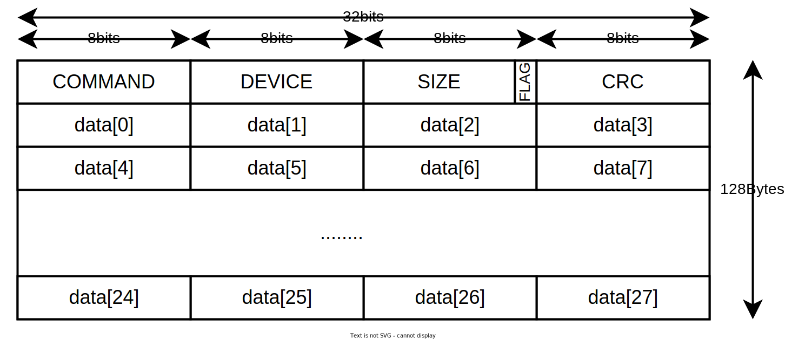

****# Communication Defy Protocol

This documentation will explain the protocol used between the keyscanner and the neuron.

## Protocol

All the protocol packets and communications are declared in
the [Communications_protocol.h](https://github.com/Dygmalab/DefyCommunications/blob/main/src/Communications_protocol.h).

https://github.com/Dygmalab/DefyCommunications/blob/main/src/Communications_protocol.h


**Diagram class of Communications_protocol.**

### Packet



```cpp
struct Header {
  Commands command;
  Devices device;
  struct {
    uint8_t size : 7;
    bool has_more_packets : 1;
  };
};
static_assert(sizeof(Header) == (sizeof(uint8_t) * 3));

static const constexpr uint8_t MAX_TRANSFER_SIZE = 128;

union Packet {
  struct {
    Header header;
    uint8_t data[MAX_TRANSFER_SIZE - sizeof(Header)];
  };
  uint8_t buf[MAX_TRANSFER_SIZE];
};
static_assert(sizeof(Packet) == MAX_TRANSFER_SIZE);
```

A Packet is a buffer of max side 128Bytes composed of a header and the data.

#### Header

Composed by:

1. [Command](#commands)
2. [Device](#devices)
3. Size the number of bytes of the [data](#data)
4. Boolean that indicates if the neuron has more packets to send, this way the keyscanner can pool him until there is no
   more messages in the queue.

#### Data

Data is a buffer of max side 128 - the side of the header.
This will contain the actual message of to send, of example is the command is **HAS_KEYS**, the field size of the header
will be 5 and in the data buffer data[0..4] will be fill with the KeyMatrix data.

### Devices

Devices is the enum that declares which device is sending the packet.
For example in the case of the RF all the communication will go trough only one SPI line, with the device the neuron
will
be able to check if the received packet if from the left side or right side, also the same is applied to the KeyScanner
this way it will know if the communication is with a Defy Wired o Wireless.

```cpp
enum Devices : uint8_t {
  UNKNOWN = 0,
  KEYSCANNER_DEFY_LEFT,
  KEYSCANNER_DEFY_RIGHT,
  NEURON_DEFY_WIRED,
  NEURON_DEFY_WIRELESS,
};
```

### Commands

The commands is the api of communication between the keyscanner and the neuron. This way for example at startup the
keyscanner will send a **CONNECTED** command to the Neuron to indicate that it is the first time the connection has been
made.

Each Xms a **IS_ALIVE** command will be sent to indicate that the communication is still open.
And the rest of the commands are almost self explanatory. But will be explain in detail down below.

```cpp
enum Commands : uint8_t {
IS_DEAD = 0,
IS_ALIVE,
CONNECTED,
DISCONNECTED,
SLEEP,
WAKE_UP,
GET_VERSION,
SET_ALIVE_INTERVAL,
//Keys
HAS_KEYS = 10,
SET_KEYSCAN_INTERVAL,
//LEDS
SET_BRIGHTNESS = 20,
SET_MODE_LED,
SET_LED,
SET_LED_BANK,
SET_PALETTE_COLORS,
SET_LAYER_KEYMAP_COLORS,
SET_LAYER_UNDERGLOW_COLORS,
GET_OPEN_LED,
GET_SHORT_LED,
};
```


